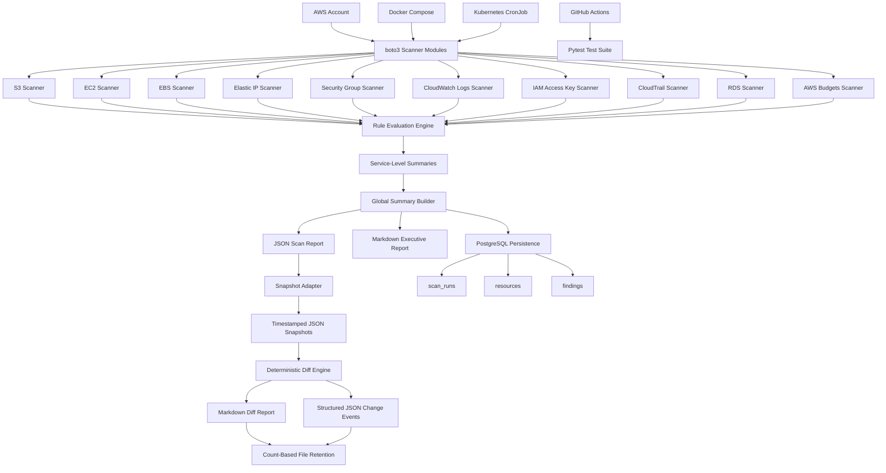
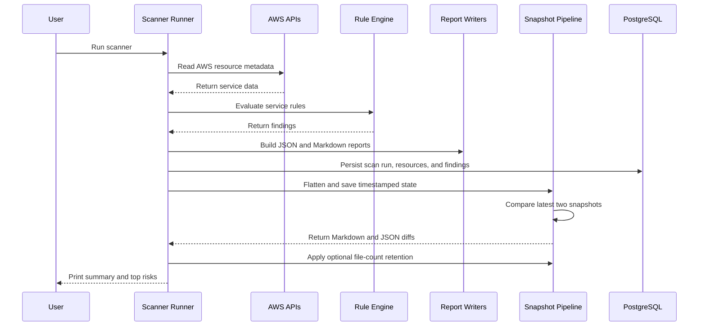
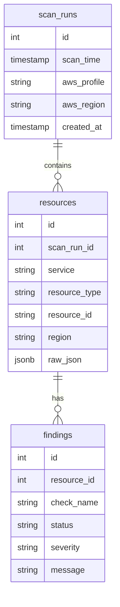

# Architecture

AWS Free-Tier Guardian is a read-only AWS governance scanner built with Python, boto3, PostgreSQL, Docker, Kubernetes, and GitHub Actions.

## High-Level Architecture

## Execution Flow

## Data Model

## Design Principles

* Read-only AWS access
* Least-privilege IAM policies
* Service-specific scanner modules
* Service-specific rule modules
* Normalized PostgreSQL persistence
* JSONB storage for raw AWS resource metadata
* Human-readable Markdown reporting
* Versioned, machine-readable JSON change events
* Opt-in, count-based snapshot retention
* Unit-tested rule evaluation
* Redacted public example reports
* Docker and Kubernetes execution support
